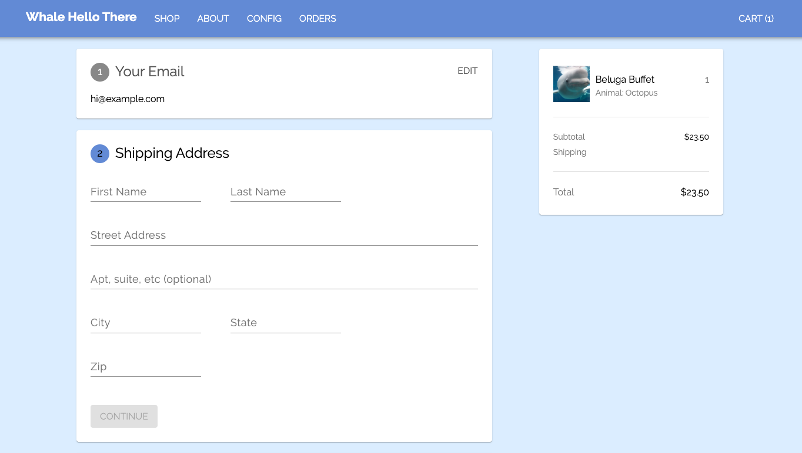

# 🎷🐋 Beluga

### Build your own ecommerce site!

Beluga is open-source software for creating your own ecommerce site. It is built with React + Node.js, and uses [Stripe](https://stripe.com/) for payment processing.

#### Visit [belugajs.com](https://belugajs.com) for documentation, tutorials, and a gallery.

Beluga is the next iteration of [react-stripe-store](https://github.com/binx/react-stripe-store)

